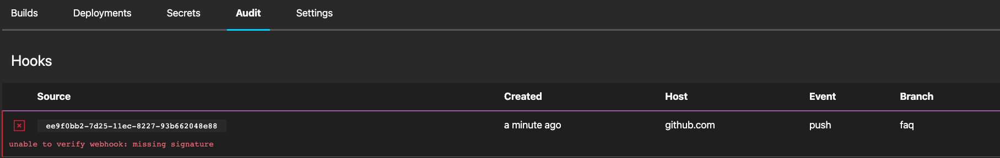
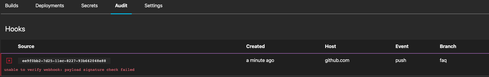
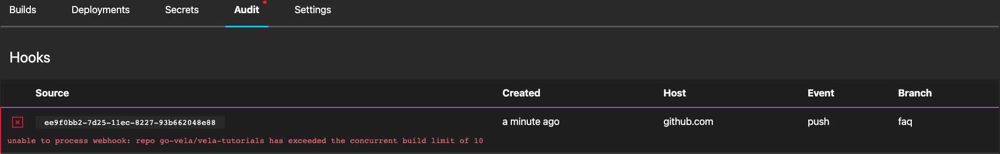
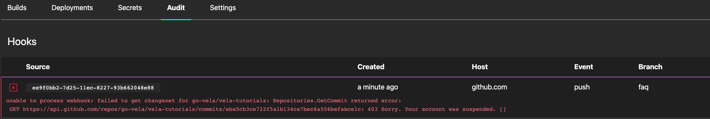

## Why is my build not displaying?

This behavior can occur for several reasons that may or may not be visually apparent.

The first step to troubleshooting this issue requires viewing the webhook deliveries for the repository.

This can be accomplished by using one of the following methods:

* **UI** - Navigate to the `https://vela.example.com/<org>/<repo>/hooks` page for the repository
* **CLI** - Run [the `vela get hooks --org <org> --repo <repo>` command for the repository](/docs/reference/cli/hook/get/)

After finding the error for the webhook delivery, please use the list below which includes details on how to resolve the issue.

### Missing Webhook Signature

This behavior indicates the signature, used to verify authenticity of the webhook, for the repository has been removed.

To resolve the issue, the repository will need to be repaired which will recreate the webhook with a valid signature.

This can be accomplished by using one of the following methods:

* **UI** - Click the `Repair` button on the `https://vela.example.com/<org>/<repo>/settings` page for the repository
* **CLI** - Run [the `vela repair repo --org <org> --repo <repo>` command for the repository](/docs/reference/cli/repo/repair/)

{}
An access level of `admin` is required in order to repair a repository.
{}

### Payload Signature Check Failed

This behavior indicates the signature, used to verify authenticity of the webhook, for the repository has been corrupted.

To resolve the issue, the repository will need to be repaired which will recreate the webhook with a valid signature.

This can be accomplished by using one of the following methods:

* **UI** - Click the `Repair` button on the `https://vela.example.com/<org>/<repo>/settings` page for the repository
* **CLI** - Run [the `vela repair repo --org <org> --repo <repo>` command for the repository](/docs/reference/cli/repo/repair/)

{}
An access level of `admin` is required in order to repair a repository.
{}

### Repo Exceeded Build Limit

This behavior indicates the number of `pending` or `running` builds for the repository exceeded the concurrent build limit.

To resolve the issue, find a build with a `pending` or `running` status and cancel it (or wait for it to complete).

This can be accomplished by using one of the following methods:

* **UI** - Click the `Cancel Build` button on the `https://vela.example.com/<org>/<repo>/<build>` page for the repository
* **CLI** - Run [the `vela cancel build --org <org> --repo <repo> --build <build>` command for the repository](/docs/reference/cli/build/cancel/)

{}
An alternative solution is to increase the build limit for the repository.

This can be accomplished by using one of the following methods:

* **UI** - Update the `Build Limit` field on the `https://vela.example.com/<org>/<repo>/settings` page for the repository
* **CLI** - Run [the `vela update repo --org <org> --repo <repo> --build.limit <limit>` command for the repository](/docs/reference/cli/repo/update/)
{}

### YAML Errors

TODO:

### Your Account Was Suspended

This behavior indicates the user who originally enabled the repository had their account suspended in the SCM.

To resolve the issue, the repository owner will need to be changed to an unsuspended user in the SCM.

This can be accomplished by using one of the following methods:

* **UI** - Click the `Chown` button on the `https://vela.example.com/<org>/<repo>/settings` page for the repository
* **CLI** - Run [the `vela chown repo --org <org> --repo <repo>` command for the repository](/docs/reference/cli/repo/chown/)

{}
An access level of `admin` is required in order to change ownership of a repository.
{}

## Why is my build not running?

This behavior indicates the number of `running` builds for the system is greater than the number of workers available.

Unfortunately, the only way to resolve the issue is to wait until a worker becomes available to run your build.

